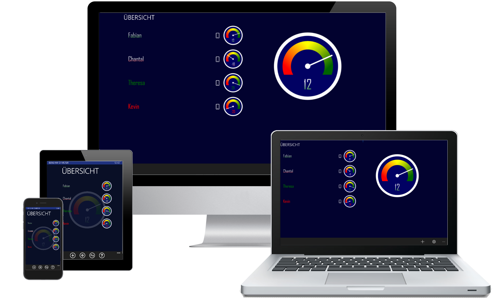

## Hast du es satt, dass dein Kind nie sein Zimmer aufräumt? 
# Damit ist jetzt Schluss!
> 

### Vielleicht vergisst du auch manchmal dein Kind zu loben, wenn es ohne zu murren die Zähne geputzt hat?
# Jetzt nicht mehr!

Denn jetzt gibt es das mobile Verhaltensmessgerät, das [benehm-O-meter].

# [benehm-O-meter]
Das [benehm-O-meter] hilft dir und deinem Kind dabei, direktes Feedback zu seinem Verhalten zu erhalten.
Mit Pluspunkten lobst du das Einhalten von Grenzen oder Regeln.
Unerwünschtes Verhalten kannst du mit der Vergabe von Minuspunkten rückmelden.

## Hintergrund
Das **benehm-O-meter** bietet dir eine mobile Lösung zur Umsetzung eines Punktesystems, welches als bewehrtes Mittel zur Unterstützung im Erziehungsalltag - u.a. bekannt aus dem TV und in Abwandlungen auch in Schulen angewandt. 

Gerade **besonders** aktiven Kindern hilft ein gut *strukturiertes* und *konsequent* eingehaltenes Regelwerk im Alltag ungemein – und sorgt nicht zuletzt auch für entspannte Eltern 👍.

## Wann brauche ich sowas überhaupt?

Wenn dein Kind:
- 😱 Nie freiwillig sein Zimmer aufräumt
- 🦷 Ständig nörgelt beim Zähneputzen
- ⏲️ Regelmäßig zu spät kommt
- ✋ Sich nur unter Protest die Hände wäscht
- 🚪 Nicht weiß wie Türklinken funktionieren
- etc.

## Das ist doch totaler Quatsch!

Stimmt, wenn du:
- 🦜 Nicht den Eindruck hast, ein Papagei zu sein
- 🍞 Nach dem Essen feststellst, dass du nicht zu fegen brauchst
- 🦷 Noch nie von vertrockneten Zahnpasta-Tuben gehört hast
- 😠 pubertäre Spannungen - wenn überhaupt - nur aus deiner Jungend kennst

## Ach übrigens:
Natürlich kannst du mit dem [benehm-O-meter] auch dein Umfeld *im Auge behalten*.
 - ❤️ Ob sich dein Partner z.B. diese spezielle Massage *verdient* hat
 - 📆 Du mit dem Kollegen wirklich die Spätschicht tauscht
 - 🌻Der sonst so nervigen Nachbarin während Ihres Urlaubs die Blumen gießt 
      > Und wenn ja, wie oft ?.🥀

Viel Spaß und Erfolg mit dem [benehm-O-meter]!

# Stay tuned 📻...

Das [benehm-O-meter] wird von Grund auf neu aufgebaut.

- 2021-02-07 : Das [benehm-O-meter] ist bald wieder für euch da!
  > Wir arbeiten an einem kompletten re-launch!

  [benehm-O-meter]:https://www.benehm-o-meter.de